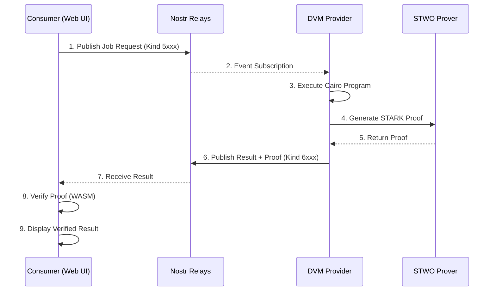

# Soul Society: Product Requirements Document & Implementation Plan

> **Version**: 1.0.0  
> **Status**: MVP Specification  
> **Author**: Abdel / StarkWare  
> **Last Updated**: December 2025

---

## Executive Summary

**Soul Society** is a permissionless marketplace for verifiable digital services, leveraging Nostr for decentralized communication and STARKs for cryptographic proof of computational integrity. It extends the Askeladd proof-of-concept into a production-ready platform where service providers offer Cairo-based verifiable computations, and consumers can request, pay for, and verify results trustlessly.

### Core Value Proposition

*"Don't Trust. Verify."*

- **Censorship-Resistant**: No central authority can shut down services
- **Mathematically Verified**: Every computation comes with a STARK proof
- **Permissionless**: Anyone can provide or consume services
- **Lightning-Native Payments**: Instant Bitcoin micropayments via Lightning Network

---

## Table of Contents

1. [Product Vision & Goals](#1-product-vision--goals)
2. [Architecture Overview](#2-architecture-overview)
3. [Monorepo Structure](#3-monorepo-structure)
4. [Core Components](#4-core-components)
5. [MVP Services (DVMs)](#5-mvp-services-dvms)
6. [Technical Specifications](#6-technical-specifications)
7. [Implementation Plan](#7-implementation-plan)
8. [Infrastructure as Code](#8-infrastructure-as-code)
9. [Testing Strategy](#9-testing-strategy)
10. [Development Guidelines](#10-development-guidelines)
11. [Deployment & Operations](#11-deployment--operations)

---

## 1. Product Vision & Goals

### 1.1 Vision Statement

Build the infrastructure layer for the **Integrity Web** — a permissionless marketplace where every digital service provides cryptographic proof of correct execution, enabling trust-minimized computation at global scale.

### 1.2 MVP Goals

| Goal | Success Metric |
|------|----------------|
| Launch 3 working DVM services | Services respond within SLA |
| End-to-end proof verification | 100% of jobs produce verifiable proofs |
| Local development experience | `docker compose up` runs full stack |
| Cloud deployment ready | Infrastructure as code for GCP/AWS |
| Web UI for service discovery | Users can browse, request, and verify jobs |

### 1.3 Target Users

1. **Service Consumers**: Developers/users who need verifiable computation
2. **Service Providers**: Operators running DVM nodes with proving capabilities
3. **Ecosystem Developers**: Building on top of Soul Society primitives

### 1.4 Non-Goals (MVP)

- Payment escrow/dispute resolution (future)
- Reputation system (future)
- Custom Cairo program uploads by users (future)
- Multi-proof aggregation (future)

---

## 2. Architecture Overview

### 2.1 High-Level Architecture

```
┌─────────────────────────────────────────────────────────────────────────────┐
│                              SOUL SOCIETY                                    │
├─────────────────────────────────────────────────────────────────────────────┤
│                                                                              │
│   ┌──────────────┐    ┌──────────────┐    ┌──────────────┐                 │
│   │   Consumer   │    │    Nostr     │    │   Provider   │                 │
│   │   (Web UI)   │◄──►│   Relays     │◄──►│   (DVM)      │                 │
│   └──────┬───────┘    └──────────────┘    └──────┬───────┘                 │
│          │                                        │                         │
│          │ Request Job (Kind 5xxx)               │ Fetch Jobs               │
│          │                                        │                         │
│          │                                        ▼                         │
│          │                              ┌──────────────────┐                │
│          │                              │  Cairo Program   │                │
│          │                              │  Execution       │                │
│          │                              └────────┬─────────┘                │
│          │                                       │                          │
│          │                                       ▼                          │
│          │                              ┌──────────────────┐                │
│          │                              │   STWO Prover    │                │
│          │                              │   (Proof Gen)    │                │
│          │                              └────────┬─────────┘                │
│          │                                       │                          │
│          │ Receive Result + Proof (Kind 6xxx)   │                          │
│          ◄───────────────────────────────────────┘                          │
│          │                                                                  │
│          ▼                                                                  │
│   ┌──────────────┐                                                         │
│   │ STWO Verify  │                                                         │
│   │ (WASM/Rust)  │                                                         │
│   └──────────────┘                                                         │
│                                                                              │
└─────────────────────────────────────────────────────────────────────────────┘
```

### 2.2 Component Interaction Flow



### 2.3 Technology Stack

| Layer | Technology | Rationale |
|-------|------------|-----------|
| **Communication** | Nostr (NIP-90) | Censorship-resistant, decentralized |
| **Proving** | STWO Prover | Fastest STARK prover, Circle STARKs |
| **Programs** | Cairo | Native provable computation language |
| **Web Frontend** | React + TypeScript + Vite | Modern, fast development |
| **Provider Backend** | Rust | Performance, safety, STWO integration |
| **Verification (WASM)** | Rust → WASM | Client-side verification |
| **Infrastructure** | Docker Compose | Local dev + cloud deployment |
| **Payments** | Lightning Network (NIP-57) | Instant Bitcoin micropayments |

---

## 3. Monorepo Structure

### 3.1 Repository Layout

```
soul-society/
├── .github/
│   ├── workflows/
│   │   ├── ci.yml                    # Main CI pipeline
│   │   ├── release.yml               # Release automation
│   │   └── deploy.yml                # Cloud deployment
│   └── CODEOWNERS
│
├── apps/
│   ├── web/                          # React frontend (existing mocked UI)
│   │   ├── src/
│   │   │   ├── components/
│   │   │   │   ├── ui/               # Reusable UI components
│   │   │   │   ├── marketplace/      # Service marketplace components
│   │   │   │   ├── jobs/             # Job tracking components
│   │   │   │   └── verification/     # Proof verification components
│   │   │   ├── hooks/                # Custom React hooks
│   │   │   ├── lib/
│   │   │   │   ├── nostr/            # Nostr client logic
│   │   │   │   ├── verification/     # WASM verification bindings
│   │   │   │   └── services/         # Service definitions
│   │   │   ├── stores/               # State management (Zustand)
│   │   │   ├── types/                # TypeScript types
│   │   │   └── App.tsx
│   │   ├── public/
│   │   ├── index.html
│   │   ├── package.json
│   │   ├── vite.config.ts
│   │   └── tailwind.config.ts
│   │
│   └── provider/                     # DVM Service Provider (Rust)
│       ├── src/
│       │   ├── main.rs
│       │   ├── nostr/                # Nostr client & event handling
│       │   ├── executor/             # Cairo program execution
│       │   ├── prover/               # STWO proving integration
│       │   ├── services/             # DVM service implementations
│       │   │   ├── mod.rs
│       │   │   ├── fibonacci.rs      # Service 1: Fibonacci
│       │   │   ├── hash_verifier.rs  # Service 2: Hash verification
│       │   │   └── merkle_proof.rs   # Service 3: Merkle proof
│       │   └── config/
│       ├── Cargo.toml
│       └── Dockerfile
│
├── crates/
│   ├── soul-core/                    # Shared core library
│   │   ├── src/
│   │   │   ├── lib.rs
│   │   │   ├── types.rs              # Shared types (Job, Proof, etc.)
│   │   │   ├── nostr_events.rs       # DVM event kinds & parsing
│   │   │   └── constants.rs
│   │   └── Cargo.toml
│   │
│   ├── soul-cairo/                   # Cairo programs
│   │   ├── src/
│   │   │   ├── fibonacci.cairo       # Fibonacci computation
│   │   │   ├── hash_verifier.cairo   # Hash verification
│   │   │   └── merkle_proof.cairo    # Merkle proof verification
│   │   ├── tests/
│   │   └── Scarb.toml
│   │
│   ├── soul-prover/                  # STWO prover wrapper
│   │   ├── src/
│   │   │   ├── lib.rs
│   │   │   ├── prover.rs             # STWO proving logic
│   │   │   └── verifier.rs           # STWO verification logic
│   │   └── Cargo.toml
│   │
│   └── soul-wasm/                    # WASM bindings for web
│       ├── src/
│       │   ├── lib.rs
│       │   └── bindings.rs           # JS-friendly WASM API
│       ├── Cargo.toml
│       └── build.sh
│
├── packages/
│   └── soul-sdk/                     # TypeScript SDK for integration
│       ├── src/
│       │   ├── index.ts
│       │   ├── client.ts             # Soul Society client
│       │   ├── types.ts              # TypeScript types
│       │   └── verification.ts       # WASM verification wrapper
│       ├── package.json
│       └── tsconfig.json
│
├── infra/
│   ├── docker/
│   │   ├── Dockerfile.web
│   │   ├── Dockerfile.provider
│   │   └── Dockerfile.relay          # Optional local Nostr relay
│   ├── docker-compose.yml            # Local development stack
│   ├── docker-compose.prod.yml       # Production configuration
│   ├── terraform/                    # Cloud infrastructure
│   │   ├── gcp/
│   │   │   ├── main.tf
│   │   │   ├── variables.tf
│   │   │   └── outputs.tf
│   │   └── aws/
│   │       ├── main.tf
│   │       ├── variables.tf
│   │       └── outputs.tf
│   └── k8s/                          # Kubernetes manifests (optional)
│       ├── web-deployment.yaml
│       └── provider-deployment.yaml
│
├── scripts/
│   ├── setup.sh                      # Initial setup script
│   ├── build-wasm.sh                 # Build WASM bindings
│   ├── run-local.sh                  # Start local dev environment
│   └── test-services.sh              # Test all DVM services
│
├── docs/
│   ├── architecture.md
│   ├── api-reference.md
│   ├── dvm-specification.md
│   ├── adding-new-service.md
│   └── deployment-guide.md
│
├── .env.example
├── Cargo.toml                        # Workspace Cargo.toml
├── package.json                      # Root package.json (workspaces)
├── pnpm-workspace.yaml
├── turbo.json                        # Turborepo config
├── rustfmt.toml
├── .gitignore
├── LICENSE
└── README.md
```

### 3.2 Workspace Configuration

**Root `Cargo.toml`**:
```toml
[workspace]
resolver = "2"
members = [
    "apps/provider",
    "crates/soul-core",
    "crates/soul-cairo",
    "crates/soul-prover",
    "crates/soul-wasm",
]

[workspace.package]
version = "0.1.0"
edition = "2021"
license = "MIT"
repository = "https://github.com/AbdelStark/SoulSociety"

[workspace.dependencies]
tokio = { version = "1.35", features = ["full"] }
serde = { version = "1.0", features = ["derive"] }
serde_json = "1.0"
thiserror = "1.0"
anyhow = "1.0"
tracing = "0.1"
tracing-subscriber = { version = "0.3", features = ["env-filter"] }

# Nostr
nostr-sdk = "0.35"
nostr = "0.35"

# STWO
stwo-prover = { git = "https://github.com/starkware-libs/stwo" }

# WASM
wasm-bindgen = "0.2"
js-sys = "0.3"
web-sys = { version = "0.3", features = ["console"] }
```

**Root `package.json`**:
```json
{
  "name": "soul-society",
  "private": true,
  "workspaces": [
    "apps/web",
    "packages/*"
  ],
  "scripts": {
    "dev": "turbo run dev",
    "build": "turbo run build",
    "test": "turbo run test",
    "lint": "turbo run lint",
    "build:wasm": "./scripts/build-wasm.sh",
    "setup": "./scripts/setup.sh"
  },
  "devDependencies": {
    "turbo": "^2.0.0",
    "typescript": "^5.3.0"
  },
  "packageManager": "pnpm@9.0.0"
}
```

---

## 4. Core Components

### 4.1 Nostr Event Schema (NIP-90 Extension)

Soul Society uses NIP-90 Data Vending Machine events with custom kinds for each service.

#### Job Request Events (Kind 5xxx)

```typescript
interface DVMJobRequest {
  kind: number;              // 5600-5999 based on service
  pubkey: string;            // Customer pubkey
  created_at: number;        // Unix timestamp
  tags: [
    ["i", "<input_data>", "<input_type>"],    // Input parameters
    ["param", "<key>", "<value>"],            // Additional params
    ["output", "<mime_type>"],                // Expected output type
    ["relays", "<relay_url>", ...],           // Preferred relays
    ["bid", "<amount_msats>"],                // Payment offer
  ];
  content: string;           // Optional encrypted content
  sig: string;               // Event signature
}
```

#### Job Result Events (Kind 6xxx)

```typescript
interface DVMJobResult {
  kind: number;              // 6600-6999 corresponding to request
  pubkey: string;            // Provider pubkey
  created_at: number;
  tags: [
    ["e", "<request_event_id>"],              // Reference to request
    ["p", "<customer_pubkey>"],               // Customer reference
    ["status", "success" | "error"],          // Job status
    ["amount", "<amount_msats>"],             // Final price
  ];
  content: string;           // JSON: { result: ..., proof: ... }
  sig: string;
}
```

#### Soul Society Custom Kinds

| Kind | Service | Description |
|------|---------|-------------|
| 5601 | Fibonacci | Compute Fibonacci(n) with proof |
| 5602 | HashVerify | Verify hash preimage |
| 5603 | MerkleProof | Verify Merkle inclusion |
| 6601 | FibonacciResult | Fibonacci result + proof |
| 6602 | HashVerifyResult | Hash verification result + proof |
| 6603 | MerkleProofResult | Merkle proof result + proof |

### 4.2 Core Types (Rust)

**`crates/soul-core/src/types.rs`**:

```rust
use serde::{Deserialize, Serialize};

/// Unique identifier for a job
pub type JobId = String;

/// Service identifier
#[derive(Debug, Clone, Serialize, Deserialize, PartialEq, Eq, Hash)]
pub enum ServiceType {
    Fibonacci,
    HashVerify,
    MerkleProof,
}

impl ServiceType {
    pub fn request_kind(&self) -> u32 {
        match self {
            ServiceType::Fibonacci => 5601,
            ServiceType::HashVerify => 5602,
            ServiceType::MerkleProof => 5603,
        }
    }
    
    pub fn result_kind(&self) -> u32 {
        match self {
            ServiceType::Fibonacci => 6601,
            ServiceType::HashVerify => 6602,
            ServiceType::MerkleProof => 6603,
        }
    }
}

/// Job status lifecycle
#[derive(Debug, Clone, Serialize, Deserialize, PartialEq, Eq)]
pub enum JobStatus {
    Pending,
    Processing,
    Proven,
    Verified,
    Failed(String),
}

/// Job request from customer
#[derive(Debug, Clone, Serialize, Deserialize)]
pub struct JobRequest {
    pub id: JobId,
    pub service: ServiceType,
    pub input: JobInput,
    pub bid_msats: u64,
    pub customer_pubkey: String,
    pub created_at: u64,
}

/// Service-specific input
#[derive(Debug, Clone, Serialize, Deserialize)]
#[serde(tag = "type")]
pub enum JobInput {
    Fibonacci { n: u64 },
    HashVerify { hash: String, preimage: String },
    MerkleProof { root: String, leaf: String, proof: Vec<String>, index: u64 },
}

/// Job result with proof
#[derive(Debug, Clone, Serialize, Deserialize)]
pub struct JobResult {
    pub id: JobId,
    pub request_id: JobId,
    pub status: JobStatus,
    pub output: Option<JobOutput>,
    pub proof: Option<StarkProof>,
    pub execution_time_ms: u64,
}

/// Service-specific output
#[derive(Debug, Clone, Serialize, Deserialize)]
#[serde(tag = "type")]
pub enum JobOutput {
    Fibonacci { result: String },
    HashVerify { valid: bool },
    MerkleProof { valid: bool },
}

/// STARK proof wrapper
#[derive(Debug, Clone, Serialize, Deserialize)]
pub struct StarkProof {
    /// Serialized STWO proof
    pub proof_bytes: Vec<u8>,
    /// Proof commitment
    pub commitment: String,
    /// Public inputs used for verification
    pub public_inputs: Vec<String>,
}
```

### 4.3 Web UI Components Architecture

**Component Hierarchy**:

```
App
├── Header
│   ├── Logo
│   ├── Navigation
│   └── WalletConnect (NIP-07)
│
├── MarketplacePage
│   ├── SearchBar
│   ├── ServiceGrid
│   │   └── ServiceCard
│   └── FilterTags
│
├── ServiceDetailPage
│   ├── ServiceHeader
│   ├── ServiceForm (dynamic based on service)
│   ├── PricingInfo
│   └── SubmitButton
│
├── JobsPage
│   ├── JobsList
│   │   └── JobCard
│   │       ├── StatusIndicator
│   │       ├── ProgressBar
│   │       └── VerifyButton
│   └── JobSubscription (live updates)
│
├── VerificationModal
│   ├── VerificationSteps
│   ├── ProofDetails
│   └── ResultDisplay
│
└── Footer
```

### 4.4 State Management (Zustand)

**`apps/web/src/stores/jobStore.ts`**:

```typescript
import { create } from 'zustand';
import { subscribeWithSelector } from 'zustand/middleware';

interface Job {
  id: string;
  serviceId: string;
  status: 'pending' | 'processing' | 'proven' | 'verified';
  timestamp: number;
  input: any;
  output?: any;
  proof?: {
    bytes: Uint8Array;
    commitment: string;
    publicInputs: string[];
  };
  progress?: number;
}

interface JobStore {
  jobs: Map<string, Job>;
  activeJobId: string | null;
  
  // Actions
  addJob: (job: Job) => void;
  updateJob: (id: string, updates: Partial<Job>) => void;
  setActiveJob: (id: string | null) => void;
  
  // Selectors
  getJobsByStatus: (status: Job['status']) => Job[];
  getJobById: (id: string) => Job | undefined;
}

export const useJobStore = create<JobStore>()(
  subscribeWithSelector((set, get) => ({
    jobs: new Map(),
    activeJobId: null,
    
    addJob: (job) => set((state) => {
      const newJobs = new Map(state.jobs);
      newJobs.set(job.id, job);
      return { jobs: newJobs };
    }),
    
    updateJob: (id, updates) => set((state) => {
      const newJobs = new Map(state.jobs);
      const existing = newJobs.get(id);
      if (existing) {
        newJobs.set(id, { ...existing, ...updates });
      }
      return { jobs: newJobs };
    }),
    
    setActiveJob: (id) => set({ activeJobId: id }),
    
    getJobsByStatus: (status) => {
      return Array.from(get().jobs.values()).filter(j => j.status === status);
    },
    
    getJobById: (id) => get().jobs.get(id),
  }))
);
```

---

## 5. MVP Services (DVMs)

### 5.1 Service 1: Fibonacci Computation

**Purpose**: Compute the n-th Fibonacci number with STARK proof of correct computation.

**Use Case**: Demonstrates basic verifiable computation for arithmetic operations.

#### Cairo Program

**`crates/soul-cairo/src/fibonacci.cairo`**:

```cairo
// Fibonacci computation with public inputs/outputs for STARK proving

fn main() -> felt252 {
    // Input: n (which Fibonacci number to compute)
    let n: u64 = get_input();
    
    // Compute Fibonacci
    let result = fibonacci(n);
    
    // Output result (becomes part of public inputs)
    output(result);
    
    result
}

fn fibonacci(n: u64) -> felt252 {
    if n <= 1 {
        return n.into();
    }
    
    let mut a: felt252 = 0;
    let mut b: felt252 = 1;
    let mut i: u64 = 2;
    
    loop {
        if i > n {
            break;
        }
        let temp = b;
        b = a + b;
        a = temp;
        i += 1;
    };
    
    b
}
```

#### Input/Output Schema

```typescript
// Request
interface FibonacciRequest {
  n: number;  // 1-1000 (bounded for MVP)
}

// Response
interface FibonacciResponse {
  result: string;  // BigInt as string
  proof: StarkProof;
}
```

#### Service Provider Implementation

**`apps/provider/src/services/fibonacci.rs`**:

```rust
use soul_core::{JobInput, JobOutput, JobResult, StarkProof};
use soul_prover::StwoPover;
use anyhow::Result;

pub struct FibonacciService {
    prover: StwoProver,
}

impl FibonacciService {
    pub fn new() -> Self {
        Self {
            prover: StwoProver::new(),
        }
    }
    
    pub async fn execute(&self, input: &JobInput) -> Result<JobResult> {
        let JobInput::Fibonacci { n } = input else {
            anyhow::bail!("Invalid input type for Fibonacci service");
        };
        
        // Validate bounds
        if *n > 1000 {
            anyhow::bail!("n must be <= 1000");
        }
        
        let start = std::time::Instant::now();
        
        // Execute Cairo program and generate trace
        let trace = self.execute_cairo(*n)?;
        
        // Generate STARK proof
        let proof = self.prover.prove(&trace)?;
        
        // Compute result
        let result = self.compute_fibonacci(*n);
        
        Ok(JobResult {
            output: Some(JobOutput::Fibonacci { 
                result: result.to_string() 
            }),
            proof: Some(StarkProof {
                proof_bytes: proof.to_bytes(),
                commitment: proof.commitment_hex(),
                public_inputs: vec![n.to_string(), result.to_string()],
            }),
            execution_time_ms: start.elapsed().as_millis() as u64,
            ..Default::default()
        })
    }
    
    fn compute_fibonacci(&self, n: u64) -> u128 {
        if n <= 1 {
            return n as u128;
        }
        let mut a: u128 = 0;
        let mut b: u128 = 1;
        for _ in 2..=n {
            let temp = b;
            b = a + b;
            a = temp;
        }
        b
    }
    
    fn execute_cairo(&self, n: u64) -> Result<CairoTrace> {
        // Execute Cairo program to generate execution trace
        // This integrates with Cairo VM
        todo!("Implement Cairo execution")
    }
}
```

---

### 5.2 Service 2: Hash Verification

**Purpose**: Verify that a given preimage hashes to a specific hash value.

**Use Case**: Proves knowledge of a preimage without revealing it (after verification, preimage can be discarded).

#### Cairo Program

**`crates/soul-cairo/src/hash_verifier.cairo`**:

```cairo
use core::poseidon::poseidon_hash_span;
use core::array::ArrayTrait;

fn main() -> bool {
    // Inputs
    let expected_hash: felt252 = get_input(0);
    let preimage: felt252 = get_input(1);
    
    // Compute hash of preimage
    let mut data = ArrayTrait::new();
    data.append(preimage);
    let computed_hash = poseidon_hash_span(data.span());
    
    // Verify match
    let valid = computed_hash == expected_hash;
    
    // Output result
    output(valid);
    
    valid
}
```

#### Input/Output Schema

```typescript
// Request
interface HashVerifyRequest {
  hash: string;      // Expected hash (hex)
  preimage: string;  // Preimage to verify (hex)
}

// Response
interface HashVerifyResponse {
  valid: boolean;
  proof: StarkProof;
}
```

---

### 5.3 Service 3: Merkle Proof Verification

**Purpose**: Verify that a leaf is included in a Merkle tree given the root and proof path.

**Use Case**: Verify inclusion proofs for blockchain data, file integrity, etc.

#### Cairo Program

**`crates/soul-cairo/src/merkle_proof.cairo`**:

```cairo
use core::poseidon::poseidon_hash_span;
use core::array::ArrayTrait;

fn main() -> bool {
    // Inputs
    let root: felt252 = get_input(0);
    let leaf: felt252 = get_input(1);
    let proof_len: u32 = get_input(2);
    let index: u64 = get_input(3);
    
    // Read proof elements
    let mut proof = ArrayTrait::new();
    let mut i: u32 = 0;
    loop {
        if i >= proof_len {
            break;
        }
        proof.append(get_input(4 + i));
        i += 1;
    };
    
    // Verify Merkle proof
    let valid = verify_merkle_proof(root, leaf, proof.span(), index);
    
    output(valid);
    valid
}

fn verify_merkle_proof(
    root: felt252,
    leaf: felt252,
    proof: Span<felt252>,
    index: u64
) -> bool {
    let mut current = leaf;
    let mut idx = index;
    let mut i: u32 = 0;
    
    loop {
        if i >= proof.len() {
            break;
        }
        
        let sibling = *proof.at(i);
        
        // Determine order based on index bit
        let mut data = ArrayTrait::new();
        if idx % 2 == 0 {
            data.append(current);
            data.append(sibling);
        } else {
            data.append(sibling);
            data.append(current);
        }
        
        current = poseidon_hash_span(data.span());
        idx = idx / 2;
        i += 1;
    };
    
    current == root
}
```

#### Input/Output Schema

```typescript
// Request
interface MerkleProofRequest {
  root: string;        // Merkle root (hex)
  leaf: string;        // Leaf to verify (hex)
  proof: string[];     // Sibling hashes (hex array)
  index: number;       // Leaf index
}

// Response
interface MerkleProofResponse {
  valid: boolean;
  proof: StarkProof;
}
```

---

## 6. Technical Specifications

### 6.1 Nostr Integration

#### Client Implementation (TypeScript)

**`apps/web/src/lib/nostr/client.ts`**:

```typescript
import { 
  SimplePool, 
  finalizeEvent, 
  generateSecretKey, 
  getPublicKey,
  nip19 
} from 'nostr-tools';

const DEFAULT_RELAYS = [
  'wss://relay.damus.io',
  'wss://relay.nostr.band',
  'wss://nos.lol',
];

export class SoulNostrClient {
  private pool: SimplePool;
  private secretKey: Uint8Array;
  private pubkey: string;
  private relays: string[];
  
  constructor(relays: string[] = DEFAULT_RELAYS) {
    this.pool = new SimplePool();
    this.relays = relays;
    
    // Load or generate keypair
    const stored = localStorage.getItem('soul_sk');
    if (stored) {
      this.secretKey = new Uint8Array(JSON.parse(stored));
    } else {
      this.secretKey = generateSecretKey();
      localStorage.setItem('soul_sk', JSON.stringify(Array.from(this.secretKey)));
    }
    this.pubkey = getPublicKey(this.secretKey);
  }
  
  async submitJob(
    serviceKind: number, 
    input: Record<string, any>,
    bidMsats: number
  ): Promise<string> {
    const event = finalizeEvent({
      kind: serviceKind,
      created_at: Math.floor(Date.now() / 1000),
      tags: [
        ['i', JSON.stringify(input), 'application/json'],
        ['output', 'application/json'],
        ['bid', bidMsats.toString()],
        ['relays', ...this.relays],
      ],
      content: '',
    }, this.secretKey);
    
    await Promise.any(this.pool.publish(this.relays, event));
    
    return event.id;
  }
  
  subscribeToResults(
    requestId: string,
    resultKind: number,
    onResult: (result: DVMResult) => void
  ): () => void {
    const sub = this.pool.subscribeMany(
      this.relays,
      [{
        kinds: [resultKind],
        '#e': [requestId],
      }],
      {
        onevent: (event) => {
          const result = this.parseResultEvent(event);
          onResult(result);
        },
      }
    );
    
    return () => sub.close();
  }
  
  private parseResultEvent(event: any): DVMResult {
    const content = JSON.parse(event.content);
    const statusTag = event.tags.find((t: string[]) => t[0] === 'status');
    
    return {
      eventId: event.id,
      requestId: event.tags.find((t: string[]) => t[0] === 'e')?.[1],
      status: statusTag?.[1] || 'unknown',
      result: content.result,
      proof: content.proof,
    };
  }
}
```

#### Provider Event Handler (Rust)

**`apps/provider/src/nostr/handler.rs`**:

```rust
use nostr_sdk::prelude::*;
use soul_core::{JobRequest, ServiceType};
use tokio::sync::mpsc;

pub struct NostrEventHandler {
    client: Client,
    job_sender: mpsc::Sender<JobRequest>,
}

impl NostrEventHandler {
    pub async fn new(
        secret_key: &str,
        relays: Vec<String>,
        job_sender: mpsc::Sender<JobRequest>,
    ) -> Result<Self> {
        let keys = Keys::parse(secret_key)?;
        let client = Client::new(&keys);
        
        for relay in &relays {
            client.add_relay(relay).await?;
        }
        client.connect().await;
        
        Ok(Self { client, job_sender })
    }
    
    pub async fn start_subscription(&self) -> Result<()> {
        // Subscribe to all DVM request kinds
        let filter = Filter::new()
            .kinds(vec![
                Kind::Custom(5601), // Fibonacci
                Kind::Custom(5602), // HashVerify
                Kind::Custom(5603), // MerkleProof
            ])
            .since(Timestamp::now());
        
        self.client.subscribe(vec![filter], None).await?;
        
        // Handle events
        self.client
            .handle_notifications(|notification| async {
                if let RelayPoolNotification::Event { event, .. } = notification {
                    if let Err(e) = self.handle_job_request(&event).await {
                        tracing::error!("Failed to handle job request: {}", e);
                    }
                }
                Ok(false) // Don't stop
            })
            .await?;
        
        Ok(())
    }
    
    async fn handle_job_request(&self, event: &Event) -> Result<()> {
        let service_type = match event.kind.as_u32() {
            5601 => ServiceType::Fibonacci,
            5602 => ServiceType::HashVerify,
            5603 => ServiceType::MerkleProof,
            _ => return Ok(()), // Ignore unknown kinds
        };
        
        let job = self.parse_job_request(event, service_type)?;
        self.job_sender.send(job).await?;
        
        Ok(())
    }
    
    pub async fn publish_result(&self, result: &JobResult, request_event_id: &str) -> Result<()> {
        let kind = Kind::Custom(result.service.result_kind());
        
        let content = serde_json::to_string(&ResultContent {
            result: &result.output,
            proof: &result.proof,
        })?;
        
        let event = EventBuilder::new(kind, content, vec![
            Tag::event(EventId::from_hex(request_event_id)?),
            Tag::custom(TagKind::Custom("status".into()), vec!["success"]),
        ]);
        
        self.client.send_event(event).await?;
        
        Ok(())
    }
}
```

### 6.2 STWO Integration

**`crates/soul-prover/src/prover.rs`**:

```rust
use stwo_prover::core::{
    air::AirProver,
    backend::simd::SimdBackend,
    channel::Blake2sChannel,
    pcs::PcsProver,
    prover::{StarkProof, prove},
    vcs::blake2_hash::Blake2sHasher,
};
use anyhow::Result;

pub struct StwoProver {
    backend: SimdBackend,
}

impl StwoProver {
    pub fn new() -> Self {
        Self {
            backend: SimdBackend::default(),
        }
    }
    
    pub fn prove<A: AirProver>(&self, air: &A, trace: &CairoTrace) -> Result<SerializedProof> {
        let channel = Blake2sChannel::new();
        let commitment_scheme = PcsProver::<SimdBackend, Blake2sHasher>::new();
        
        let proof = prove::<SimdBackend, Blake2sHasher, Blake2sChannel, A>(
            &self.backend,
            air,
            &commitment_scheme,
            trace,
            &channel,
        )?;
        
        Ok(SerializedProof::from_stark_proof(proof))
    }
}

pub struct StwoVerifier;

impl StwoVerifier {
    pub fn verify(proof: &SerializedProof, public_inputs: &[String]) -> Result<bool> {
        let stark_proof = proof.to_stark_proof()?;
        
        // Reconstruct AIR with public inputs
        let air = reconstruct_air(public_inputs)?;
        
        // Verify
        let result = stwo_prover::core::verifier::verify(
            &stark_proof,
            &air,
            &Blake2sChannel::new(),
        );
        
        Ok(result.is_ok())
    }
}

#[derive(Debug, Clone, serde::Serialize, serde::Deserialize)]
pub struct SerializedProof {
    pub bytes: Vec<u8>,
    pub commitment: String,
}

impl SerializedProof {
    pub fn from_stark_proof(proof: StarkProof) -> Self {
        Self {
            bytes: bincode::serialize(&proof).unwrap(),
            commitment: hex::encode(proof.commitment()),
        }
    }
    
    pub fn to_stark_proof(&self) -> Result<StarkProof> {
        Ok(bincode::deserialize(&self.bytes)?)
    }
}
```

### 6.3 WASM Verification Bindings

**`crates/soul-wasm/src/lib.rs`**:

```rust
use wasm_bindgen::prelude::*;
use soul_prover::StwoVerifier;

#[wasm_bindgen]
pub struct WasmVerifier;

#[wasm_bindgen]
impl WasmVerifier {
    #[wasm_bindgen(constructor)]
    pub fn new() -> Self {
        console_error_panic_hook::set_once();
        Self
    }
    
    #[wasm_bindgen]
    pub fn verify_proof(
        &self,
        proof_bytes: &[u8],
        public_inputs_json: &str,
    ) -> Result<bool, JsValue> {
        let public_inputs: Vec<String> = serde_json::from_str(public_inputs_json)
            .map_err(|e| JsValue::from_str(&e.to_string()))?;
        
        let proof = SerializedProof {
            bytes: proof_bytes.to_vec(),
            commitment: String::new(), // Extracted from bytes
        };
        
        StwoVerifier::verify(&proof, &public_inputs)
            .map_err(|e| JsValue::from_str(&e.to_string()))
    }
}

#[wasm_bindgen]
pub fn init_panic_hook() {
    console_error_panic_hook::set_once();
}
```

**Build script** (`crates/soul-wasm/build.sh`):

```bash
#!/bin/bash
set -e

cd "$(dirname "$0")"

# Build WASM
wasm-pack build --target web --out-dir pkg

# Copy to web app
cp -r pkg/* ../../apps/web/src/lib/verification/wasm/

echo "✅ WASM bindings built and copied to web app"
```

---

## 7. Implementation Plan

### Phase 0: Foundation (Week 1)

**Goal**: Set up monorepo structure and development environment.

| Task | Deliverable | Owner |
|------|-------------|-------|
| Initialize monorepo with workspace configs | `Cargo.toml`, `package.json`, `turbo.json` | Core |
| Set up Docker Compose for local dev | `docker-compose.yml` | Infra |
| Configure CI/CD pipeline | `.github/workflows/ci.yml` | DevOps |
| Create documentation structure | `docs/` directory | All |
| Port existing web UI to monorepo | `apps/web/` | Frontend |

**Checklist**:
- [ ] Monorepo builds with `cargo build` and `pnpm build`
- [ ] `docker compose up` starts local Nostr relay
- [ ] CI runs lints and tests
- [ ] Existing mocked UI accessible at `localhost:5173`

---

### Phase 1: Core Infrastructure (Weeks 2-3)

**Goal**: Implement core libraries and Nostr integration.

#### Week 2: Core Crates

| Task | Deliverable |
|------|-------------|
| Implement `soul-core` types | Job, Proof, Service types |
| Implement Nostr event parsing | NIP-90 event handlers |
| Set up `soul-prover` scaffold | STWO integration structure |
| Create TypeScript SDK scaffold | `packages/soul-sdk/` |

#### Week 3: Provider Skeleton

| Task | Deliverable |
|------|-------------|
| Implement provider main loop | Event subscription, job queue |
| Add Nostr client for provider | Publish results |
| Integrate with local relay | Test event flow |
| Add configuration management | `.env`, CLI args |

**Checklist**:
- [ ] Provider subscribes to job events
- [ ] Provider can publish result events
- [ ] Full event round-trip works with local relay
- [ ] TypeScript SDK can submit and receive events

---

### Phase 2: Service Implementation (Weeks 4-6)

**Goal**: Implement the 3 MVP services with proof generation.

#### Week 4: Fibonacci Service

| Task | Deliverable |
|------|-------------|
| Write Fibonacci Cairo program | `fibonacci.cairo` |
| Implement Cairo execution wrapper | Trace generation |
| Integrate STWO prover | Proof generation |
| Add Fibonacci service to provider | End-to-end flow |

#### Week 5: Hash & Merkle Services

| Task | Deliverable |
|------|-------------|
| Write HashVerify Cairo program | `hash_verifier.cairo` |
| Write MerkleProof Cairo program | `merkle_proof.cairo` |
| Add services to provider | Service routing |
| Test all services | Integration tests |

#### Week 6: WASM Verification

| Task | Deliverable |
|------|-------------|
| Build `soul-wasm` crate | WASM bindings |
| Integrate WASM in web app | Verification UI |
| Add verification modal | Step-by-step UX |
| End-to-end testing | Full flow verification |

**Checklist**:
- [ ] All 3 services generate valid STARK proofs
- [ ] WASM verification works in browser
- [ ] Web UI shows proof verification steps
- [ ] Average proof generation < 30s per service

---

### Phase 3: Web UI Polish (Weeks 7-8)

**Goal**: Transform mocked UI into functional frontend.

#### Week 7: Nostr Integration in UI

| Task | Deliverable |
|------|-------------|
| Replace mock data with live data | Real-time job updates |
| Implement NIP-07 wallet connection | Browser extension support |
| Add service submission forms | Dynamic form generation |
| Implement job status polling | Live status updates |

#### Week 8: UX Polish

| Task | Deliverable |
|------|-------------|
| Add loading states | Skeletons, spinners |
| Implement error handling | User-friendly errors |
| Add proof inspector | View proof details |
| Mobile responsiveness | Touch-friendly UI |

**Checklist**:
- [ ] Users can connect Nostr wallet
- [ ] Jobs appear in real-time
- [ ] Proof verification modal shows all steps
- [ ] Works on mobile browsers

---

### Phase 4: Infrastructure & Deployment (Weeks 9-10)

**Goal**: Production-ready infrastructure.

#### Week 9: Cloud Infrastructure

| Task | Deliverable |
|------|-------------|
| Write Terraform for GCP | `infra/terraform/gcp/` |
| Write Terraform for AWS (optional) | `infra/terraform/aws/` |
| Create production Docker configs | `docker-compose.prod.yml` |
| Set up secrets management | Environment configuration |

#### Week 10: Deployment & Monitoring

| Task | Deliverable |
|------|-------------|
| Deploy to cloud | Live environment |
| Add monitoring/logging | Observability stack |
| Write deployment docs | `docs/deployment-guide.md` |
| Performance testing | Load test results |

**Checklist**:
- [ ] Production deployment runs on GCP/AWS
- [ ] Logs aggregated and searchable
- [ ] Metrics dashboard available
- [ ] Can handle 100 concurrent jobs

---

## 8. Infrastructure as Code

### 8.1 Docker Compose (Local Development)

**`infra/docker-compose.yml`**:

```yaml
version: '3.8'

services:
  # Local Nostr Relay
  relay:
    image: scsibug/nostr-rs-relay:latest
    ports:
      - "8080:8080"
    volumes:
      - relay_data:/usr/src/app/db
    environment:
      - RUST_LOG=info
    healthcheck:
      test: ["CMD", "curl", "-f", "http://localhost:8080"]
      interval: 10s
      timeout: 5s
      retries: 3

  # DVM Provider
  provider:
    build:
      context: ..
      dockerfile: infra/docker/Dockerfile.provider
    depends_on:
      relay:
        condition: service_healthy
    environment:
      - NOSTR_RELAY_URL=ws://relay:8080
      - RUST_LOG=info,soul_provider=debug
      - PROVIDER_SECRET_KEY=${PROVIDER_SECRET_KEY:-}
    volumes:
      - provider_data:/app/data
    restart: unless-stopped

  # Web Frontend
  web:
    build:
      context: ..
      dockerfile: infra/docker/Dockerfile.web
    ports:
      - "5173:80"
    depends_on:
      - relay
    environment:
      - VITE_NOSTR_RELAY_URL=ws://localhost:8080
    healthcheck:
      test: ["CMD", "curl", "-f", "http://localhost:80"]
      interval: 10s
      timeout: 5s
      retries: 3

  # (Optional) Additional provider for redundancy
  provider-2:
    build:
      context: ..
      dockerfile: infra/docker/Dockerfile.provider
    depends_on:
      relay:
        condition: service_healthy
    environment:
      - NOSTR_RELAY_URL=ws://relay:8080
      - RUST_LOG=info
      - PROVIDER_SECRET_KEY=${PROVIDER_SECRET_KEY_2:-}
    profiles:
      - multi-provider

volumes:
  relay_data:
  provider_data:

networks:
  default:
    name: soul-society-network
```

### 8.2 Provider Dockerfile

**`infra/docker/Dockerfile.provider`**:

```dockerfile
# Build stage
FROM rust:1.75-bookworm AS builder

WORKDIR /app

# Install dependencies
RUN apt-get update && apt-get install -y \
    pkg-config \
    libssl-dev \
    && rm -rf /var/lib/apt/lists/*

# Copy workspace files
COPY Cargo.toml Cargo.lock ./
COPY crates/ crates/
COPY apps/provider/ apps/provider/

# Build release binary
RUN cargo build --release --package soul-provider

# Runtime stage
FROM debian:bookworm-slim

RUN apt-get update && apt-get install -y \
    ca-certificates \
    libssl3 \
    && rm -rf /var/lib/apt/lists/*

WORKDIR /app

# Copy binary
COPY --from=builder /app/target/release/soul-provider /app/soul-provider

# Create non-root user
RUN useradd -m -u 1000 soul
USER soul

ENTRYPOINT ["/app/soul-provider"]
```

### 8.3 Web Dockerfile

**`infra/docker/Dockerfile.web`**:

```dockerfile
# Build stage
FROM node:20-alpine AS builder

WORKDIR /app

# Install pnpm
RUN corepack enable && corepack prepare pnpm@9 --activate

# Copy workspace files
COPY package.json pnpm-workspace.yaml pnpm-lock.yaml ./
COPY apps/web/package.json apps/web/
COPY packages/ packages/

# Install dependencies
RUN pnpm install --frozen-lockfile

# Copy source
COPY apps/web/ apps/web/
COPY packages/ packages/

# Build
WORKDIR /app/apps/web
RUN pnpm build

# Runtime stage
FROM nginx:alpine

# Copy built assets
COPY --from=builder /app/apps/web/dist /usr/share/nginx/html

# Copy nginx config
COPY infra/docker/nginx.conf /etc/nginx/conf.d/default.conf

EXPOSE 80

CMD ["nginx", "-g", "daemon off;"]
```

### 8.4 Terraform (GCP)

**`infra/terraform/gcp/main.tf`**:

```hcl
terraform {
  required_providers {
    google = {
      source  = "hashicorp/google"
      version = "~> 5.0"
    }
  }
}

variable "project_id" {
  description = "GCP Project ID"
  type        = string
}

variable "region" {
  description = "GCP Region"
  type        = string
  default     = "us-central1"
}

variable "environment" {
  description = "Environment name"
  type        = string
  default     = "production"
}

provider "google" {
  project = var.project_id
  region  = var.region
}

# VPC Network
resource "google_compute_network" "soul_network" {
  name                    = "soul-society-network"
  auto_create_subnetworks = false
}

resource "google_compute_subnetwork" "soul_subnet" {
  name          = "soul-society-subnet"
  ip_cidr_range = "10.0.0.0/24"
  network       = google_compute_network.soul_network.id
  region        = var.region
}

# Cloud Run for Web Frontend
resource "google_cloud_run_v2_service" "web" {
  name     = "soul-society-web"
  location = var.region

  template {
    containers {
      image = "gcr.io/${var.project_id}/soul-web:latest"
      
      ports {
        container_port = 80
      }
      
      resources {
        limits = {
          cpu    = "1"
          memory = "512Mi"
        }
      }
    }
    
    scaling {
      min_instance_count = 1
      max_instance_count = 10
    }
  }

  traffic {
    type    = "TRAFFIC_TARGET_ALLOCATION_TYPE_LATEST"
    percent = 100
  }
}

# Allow public access to web
resource "google_cloud_run_service_iam_member" "web_public" {
  service  = google_cloud_run_v2_service.web.name
  location = var.region
  role     = "roles/run.invoker"
  member   = "allUsers"
}

# Compute Engine for Provider (needs more resources)
resource "google_compute_instance" "provider" {
  name         = "soul-provider-${var.environment}"
  machine_type = "n2-standard-4"  # 4 vCPU, 16GB RAM
  zone         = "${var.region}-a"

  boot_disk {
    initialize_params {
      image = "debian-cloud/debian-12"
      size  = 50
    }
  }

  network_interface {
    network    = google_compute_network.soul_network.id
    subnetwork = google_compute_subnetwork.soul_subnet.id
    
    access_config {
      // Ephemeral public IP
    }
  }

  metadata_startup_script = <<-EOF
    #!/bin/bash
    apt-get update
    apt-get install -y docker.io docker-compose
    
    # Pull and run provider
    docker pull gcr.io/${var.project_id}/soul-provider:latest
    docker run -d \
      --name soul-provider \
      --restart unless-stopped \
      -e NOSTR_RELAY_URL=wss://relay.damus.io \
      gcr.io/${var.project_id}/soul-provider:latest
  EOF

  service_account {
    scopes = ["cloud-platform"]
  }

  tags = ["soul-provider"]
}

# Firewall rules
resource "google_compute_firewall" "allow_internal" {
  name    = "soul-allow-internal"
  network = google_compute_network.soul_network.id

  allow {
    protocol = "tcp"
    ports    = ["0-65535"]
  }

  source_ranges = ["10.0.0.0/24"]
}

# Outputs
output "web_url" {
  value = google_cloud_run_v2_service.web.uri
}

output "provider_ip" {
  value = google_compute_instance.provider.network_interface[0].access_config[0].nat_ip
}
```

### 8.5 Local Development Script

**`scripts/run-local.sh`**:

```bash
#!/bin/bash
set -e

# Colors
GREEN='\033[0;32m'
YELLOW='\033[1;33m'
NC='\033[0m'

echo -e "${GREEN}🚀 Starting Soul Society Local Environment${NC}"

# Check prerequisites
command -v docker >/dev/null 2>&1 || { echo "Docker required but not installed. Aborting." >&2; exit 1; }
command -v docker compose >/dev/null 2>&1 || { echo "Docker Compose required. Aborting." >&2; exit 1; }

# Generate secret keys if not present
if [ ! -f .env ]; then
    echo -e "${YELLOW}Generating .env file...${NC}"
    cp .env.example .env
    
    # Generate Nostr secret keys
    PROVIDER_SK=$(openssl rand -hex 32)
    PROVIDER_SK_2=$(openssl rand -hex 32)
    
    sed -i "s/PROVIDER_SECRET_KEY=.*/PROVIDER_SECRET_KEY=${PROVIDER_SK}/" .env
    sed -i "s/PROVIDER_SECRET_KEY_2=.*/PROVIDER_SECRET_KEY_2=${PROVIDER_SK_2}/" .env
    
    echo -e "${GREEN}✅ Generated new provider keys${NC}"
fi

# Build WASM if needed
if [ ! -d "apps/web/src/lib/verification/wasm" ]; then
    echo -e "${YELLOW}Building WASM bindings...${NC}"
    ./scripts/build-wasm.sh
fi

# Start services
echo -e "${YELLOW}Starting Docker Compose...${NC}"
docker compose -f infra/docker-compose.yml up --build -d

# Wait for services
echo -e "${YELLOW}Waiting for services to be healthy...${NC}"
sleep 5

# Check health
if curl -s http://localhost:8080 > /dev/null; then
    echo -e "${GREEN}✅ Nostr Relay: http://localhost:8080${NC}"
else
    echo -e "${YELLOW}⚠️  Relay still starting...${NC}"
fi

if curl -s http://localhost:5173 > /dev/null; then
    echo -e "${GREEN}✅ Web UI: http://localhost:5173${NC}"
else
    echo -e "${YELLOW}⚠️  Web UI still starting...${NC}"
fi

echo -e "\n${GREEN}🎉 Soul Society is running!${NC}"
echo -e "   Web UI: http://localhost:5173"
echo -e "   Relay:  ws://localhost:8080"
echo -e "\nTo view logs: docker compose -f infra/docker-compose.yml logs -f"
echo -e "To stop: docker compose -f infra/docker-compose.yml down"
```

---

## 9. Testing Strategy

### 9.1 Test Pyramid

```
                    ┌─────────────┐
                    │   E2E       │  < 10 tests
                    │   Tests     │  Browser automation
                    └──────┬──────┘
                           │
                ┌──────────┴──────────┐
                │   Integration       │  20-50 tests
                │   Tests             │  Service + Nostr
                └──────────┬──────────┘
                           │
        ┌──────────────────┴──────────────────┐
        │         Unit Tests                   │  100+ tests
        │    Cairo, Rust, TypeScript          │
        └─────────────────────────────────────┘
```

### 9.2 Unit Tests

#### Cairo Programs

**`crates/soul-cairo/tests/fibonacci_test.cairo`**:

```cairo
#[cfg(test)]
mod tests {
    use super::fibonacci;
    
    #[test]
    fn test_fibonacci_base_cases() {
        assert(fibonacci(0) == 0, 'fib(0) should be 0');
        assert(fibonacci(1) == 1, 'fib(1) should be 1');
    }
    
    #[test]
    fn test_fibonacci_sequence() {
        assert(fibonacci(2) == 1, 'fib(2)');
        assert(fibonacci(3) == 2, 'fib(3)');
        assert(fibonacci(4) == 3, 'fib(4)');
        assert(fibonacci(5) == 5, 'fib(5)');
        assert(fibonacci(10) == 55, 'fib(10)');
    }
    
    #[test]
    fn test_fibonacci_large() {
        assert(fibonacci(20) == 6765, 'fib(20)');
        assert(fibonacci(50) == 12586269025, 'fib(50)');
    }
}
```

#### Rust Services

**`apps/provider/src/services/fibonacci_test.rs`**:

```rust
#[cfg(test)]
mod tests {
    use super::*;
    
    #[tokio::test]
    async fn test_fibonacci_execution() {
        let service = FibonacciService::new();
        let input = JobInput::Fibonacci { n: 10 };
        
        let result = service.execute(&input).await.unwrap();
        
        assert!(result.proof.is_some());
        match result.output {
            Some(JobOutput::Fibonacci { result }) => {
                assert_eq!(result, "55");
            }
            _ => panic!("Expected Fibonacci output"),
        }
    }
    
    #[tokio::test]
    async fn test_fibonacci_bounds() {
        let service = FibonacciService::new();
        let input = JobInput::Fibonacci { n: 1001 };
        
        let result = service.execute(&input).await;
        assert!(result.is_err());
    }
}
```

### 9.3 Integration Tests

**`tests/integration/service_flow_test.rs`**:

```rust
use soul_core::*;
use soul_provider::NostrEventHandler;
use tokio::sync::mpsc;

#[tokio::test]
async fn test_full_service_flow() {
    // Start local relay
    let relay = TestRelay::start().await;
    
    // Create provider
    let (tx, mut rx) = mpsc::channel(10);
    let handler = NostrEventHandler::new(
        "test_secret_key",
        vec![relay.url()],
        tx,
    ).await.unwrap();
    
    // Submit job request
    let client = TestClient::new(&relay.url()).await;
    let request_id = client.submit_fibonacci_job(10).await.unwrap();
    
    // Wait for job in provider queue
    let job = tokio::time::timeout(
        std::time::Duration::from_secs(5),
        rx.recv()
    ).await.unwrap().unwrap();
    
    assert_eq!(job.id, request_id);
    
    // Execute and verify
    let result = handler.execute_job(&job).await.unwrap();
    assert!(result.proof.is_some());
    
    // Verify proof
    let verified = StwoVerifier::verify(
        result.proof.as_ref().unwrap(),
        &result.proof.as_ref().unwrap().public_inputs,
    ).unwrap();
    
    assert!(verified);
}
```

### 9.4 E2E Tests (Playwright)

**`apps/web/e2e/job-submission.spec.ts`**:

```typescript
import { test, expect } from '@playwright/test';

test.describe('Job Submission Flow', () => {
  test.beforeEach(async ({ page }) => {
    await page.goto('/');
  });

  test('should submit Fibonacci job and see result', async ({ page }) => {
    // Navigate to marketplace
    await page.click('text=Marketplace');
    
    // Find Fibonacci service
    await page.click('text=Fibonacci');
    
    // Fill form
    await page.fill('input[name="n"]', '10');
    
    // Submit
    await page.click('button:has-text("Request Proof")');
    
    // Wait for redirect to jobs
    await expect(page).toHaveURL(/\/jobs/);
    
    // Wait for job completion (with timeout)
    await expect(page.locator('text=VERIFIED')).toBeVisible({
      timeout: 60000,
    });
    
    // Verify result
    await page.click('button:has-text("View Proof")');
    await expect(page.locator('text=55')).toBeVisible();
  });

  test('should show verification steps', async ({ page }) => {
    // Navigate to completed job
    await page.goto('/jobs');
    await page.click('.job-card:first-child');
    
    // Open verification modal
    await page.click('button:has-text("Verify")');
    
    // Check verification steps appear
    await expect(page.locator('text=Fetching proof')).toBeVisible();
    await expect(page.locator('text=Parsing proof data')).toBeVisible();
    await expect(page.locator('text=Running verification')).toBeVisible();
    await expect(page.locator('text=STARK proof is valid')).toBeVisible();
  });
});
```

---

## 10. Development Guidelines

### 10.1 Code Style

#### Rust

```toml
# rustfmt.toml
edition = "2021"
max_width = 100
tab_spaces = 4
use_small_heuristics = "Default"
imports_granularity = "Module"
group_imports = "StdExternalCrate"
```

#### TypeScript

```json
// .prettierrc
{
  "semi": true,
  "singleQuote": true,
  "tabWidth": 2,
  "trailingComma": "es5",
  "printWidth": 100
}
```

### 10.2 Git Workflow

```
main (protected)
  │
  ├── develop
  │     │
  │     ├── feature/add-fibonacci-service
  │     ├── feature/wasm-verification
  │     └── fix/relay-connection-timeout
  │
  └── release/v1.0.0
```

**Commit Convention**:
```
<type>(<scope>): <subject>

Types: feat, fix, docs, style, refactor, test, chore
Scopes: core, provider, web, wasm, infra, docs
```

### 10.3 Adding a New Service

1. Create Cairo program in `crates/soul-cairo/src/`
2. Add service type to `soul-core/src/types.rs`
3. Implement service in `apps/provider/src/services/`
4. Register in provider's service router
5. Add to web UI service list
6. Write tests for all layers
7. Update documentation

---

## 11. Deployment & Operations

### 11.1 Deployment Checklist

- [ ] All tests passing (unit, integration, e2e)
- [ ] WASM built and verified
- [ ] Docker images built and tagged
- [ ] Environment variables configured
- [ ] SSL certificates provisioned
- [ ] Monitoring dashboards ready
- [ ] Runbook documented

### 11.2 Monitoring Stack

| Component | Tool | Purpose |
|-----------|------|---------|
| Metrics | Prometheus | Service metrics |
| Visualization | Grafana | Dashboards |
| Logs | Loki | Log aggregation |
| Traces | Jaeger | Distributed tracing |
| Alerting | Alertmanager | Incident notifications |

### 11.3 Key Metrics

| Metric | Target |
|--------|--------|
| Job completion rate | > 99% |
| Proof generation time (p95) | < 30s |
| Verification time (p95) | < 2s |
| API availability | > 99.9% |

---

## Appendix

### A. Environment Variables

```bash
# .env.example

# Nostr Configuration
NOSTR_RELAY_URL=ws://localhost:8080
NOSTR_RELAYS=wss://relay.damus.io,wss://relay.nostr.band

# Provider Configuration  
PROVIDER_SECRET_KEY=<hex_encoded_32_bytes>
PROVIDER_NAME=soul-provider-1
PROVIDER_DESCRIPTION="Soul Society DVM Provider"

# Web Configuration
VITE_NOSTR_RELAY_URL=ws://localhost:8080
VITE_ENABLE_MOCK_MODE=false

# Logging
RUST_LOG=info,soul_provider=debug
LOG_FORMAT=json

# Feature Flags
ENABLE_LIGHTNING_PAYMENTS=false
ENABLE_MULTI_PROVIDER=false
```

### B. API Reference

See `docs/api-reference.md` for complete API documentation.

### C. Troubleshooting

Common issues and solutions documented in `docs/troubleshooting.md`.

---

## Document History

| Version | Date | Author | Changes |
|---------|------|--------|---------|
| 1.0.0 | Dec 2025 | Abdel | Initial MVP specification |

---

*"Cryptography shifts the balance of power from those with a monopoly on violence to those who comprehend mathematics and security design." - Jacob Appelbaum*
