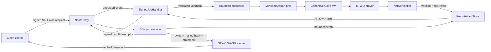

# Architecture

Soul Society has one architectural rule: every success must remain verifiable
after the provider and relay are treated as adversaries.

That rule produces a small set of deep modules. Each module hides a substantial
implementation behind a narrow interface, and each trust transition has one
explicit seam. This gives the system leverage and failure locality without
spreading Cairo, STWO, Nostr, or browser details through unrelated code.

## System topology



The relay never carries the proof itself. A real STWO proof is too large for a
healthy relay event. The provider persists proof JSON under its SHA-256 digest
and signs only a bounded descriptor.

## Deep module boundaries

### `soul-core`: Soul Wire

Interface:

- strict request/result data types;
- canonical JSON and tag construction;
- signed Nostr event authentication;
- service, field, size, freshness, expiry, and descriptor validation.

Implementation details hidden:

- Nostr tag parsing;
- canonical field encoding;
- event-kind mapping;
- sanitized public error taxonomy.

This module is the protocol authority for Rust. TypeScript mirrors it through
golden fixtures. There is no second provider-specific event parser.

### `soul-prover`: verifiable job engine

The deep interface is:

```rust
VerifiableJobEngine::prove_job(&JobInput) -> VerifiedProofArtifact
```

One call owns the complete implementation:

1. validate and flatten the typed job into Cairo Serde arguments;
2. execute the compiled Cairo executable;
3. adapt the Cairo VM trace for STWO;
4. prove with explicit 96-bit conjectured-security parameters;
5. serialize the Rust-verifier proof format;
6. require the exact reviewed FRI, proof-of-work, lifting, and canonical
   preprocessing profile, then verify the serialized proof from scratch;
7. extract the proven program hash and public output;
8. decode and validate the typed `ProofStatement`;
9. compare the program hash with an independently supplied trust manifest.

Engine construction also hashes the executable bytes and compares them with the
manifest's `artifact_sha256`. A provider therefore fails during startup when
its mounted artifact is stale, instead of discovering that mismatch on the
first proof attempt.

The provider cannot obtain a `VerifiedProofArtifact` from a shallow “generate
bytes” interface. Native verification and statement decoding are part of the
module's postcondition.

`ProgramManifestGenerator` is a separate maintainer-only seam. It discovers a
program hash while generating the first reviewed fixture. Runtime code cannot
use that seam to trust an arbitrary program.

### `soul-cairo`: computation authority

There is one executable:

```cairo
main(
    service: u8,
    public_input: Array<felt252>,
    private_input: Array<felt252>,
) -> (u8, Array<felt252>, Array<felt252>)
```

The return tuple is the public statement. Private input influences execution
but is absent from the output segment:

| Service | Public input | Private input | Public output |
|---|---|---|---|
| Fibonacci | `[n]` | `[]` | `[F(n)]` |
| Hash check | `[expected_hash]` | `[preimage]` | `[0 or 1]` |
| Merkle membership | `[root, leaf, index]` | `[siblings…]` | `[0 or 1]` |

Rust does not recompute these services and call its result “proved.” Reference
implementations are acceptable in tests, but Cairo remains authoritative.

### `ProofArtifactStore`: data availability adapter

The provider depends on a small storage interface, with filesystem and in-memory
implementations. The filesystem adapter:

- computes SHA-256 over the exact proof bytes;
- creates a hash-named JSON artifact without overwriting existing content;
- returns a descriptor only after persistence succeeds;
- serves immutable bytes from `/v1/proofs/{sha256}.json`.

Storage proves no computation. It supplies data availability long enough for a
client to fetch the already authenticated artifact.

### SDK job session

The TypeScript SDK separates four interfaces:

- signer (`NIP-07` or explicit ephemeral/local secret);
- relay transport;
- Soul Wire codec;
- proof fetch and verifier.

The application must also provide at least one trusted provider public key.
The subscription includes that author filter and the callback repeats the
allowlist check before either a success or an error can settle a job. A relay
or unrelated valid Nostr signer cannot become provider policy by responding
first.

The lifecycle is monotonic:

```text
draft → publishing → awaiting_result → result_received → fetching → verifying → verified
                                                           └→ failed
```

There is no timer-generated progress and no “verified” state before the WASM
verifier returns success. Cancellation clears subscriptions, fetches, and
timeouts.

### `soul-wasm`: hostile-input adapter

The WASM boundary accepts:

- proof JSON bytes;
- an independently trusted program hash;
- the exact expected public statement.

It enforces proof size before parsing, validates the exact reviewed verifier
profile and statement ABI, verifies STWO, and then compares both program
identity and statement. The JavaScript adapter treats returned errors or a
WASM trap as terminal rejection, never success. Proof-supplied identity and
parameters are evidence, not trust.

## End-to-end invariants

A successful client state requires every invariant:

1. request event ID and signature are valid;
2. request kind, service, canonical content, and singleton tags agree;
3. result ID and signature are valid;
4. result kind and signer match the application's explicit provider allowlist;
5. result embeds and references the exact signed request;
6. result content and tags agree;
7. descriptor format, URL policy, size, and hash are acceptable;
8. fetched byte count and SHA-256 match the descriptor;
9. proof parameters and preprocessing match the reviewed 96-bit profile;
10. STWO verifies the proof;
11. the proven Cairo program hash matches `protocol/programs.json`;
12. the proven raw public input/output match the signed typed statement.

Failure of any invariant is terminal for that result.

## Concurrency and denial-of-service locality

Relay callbacks perform bounded parsing only. CPU-heavy execution and proving
run in `spawn_blocking` behind a semaphore. In-flight duplicate request IDs are
suppressed; completed duplicates replay the exact cached signed result without
proving again. The idempotency set is bounded. Input depth, field encoding,
request size, proof size, timestamps, and expiry are checked before the
expensive seam.

This does not make proving cheap. Operators must still apply process, CPU,
memory, disk, and network limits appropriate to their hardware.

## Why these choices

- **One Cairo executable:** one program hash is easier to audit and pin than
  three drifting executables.
- **External proof artifacts:** preserves relay health and makes content
  integrity explicit.
- **Canonical duplicated input tag:** allows Nostr tooling to inspect requests
  while making content/tag disagreement invalid.
- **Application microstandard:** avoids pretending a broad, currently
  unrecommended draft is a stable interoperability contract.
- **Native self-verification:** a provider never advertises bytes it has not
  itself accepted through the same verifier semantics.
- **Fixed-width field strings:** removes number precision and multi-encoding
  ambiguity across Cairo, Rust, JSON, and TypeScript.

See [protocol.md](protocol.md) for the wire contract and
[security-model.md](security-model.md) for the remaining assumptions.
